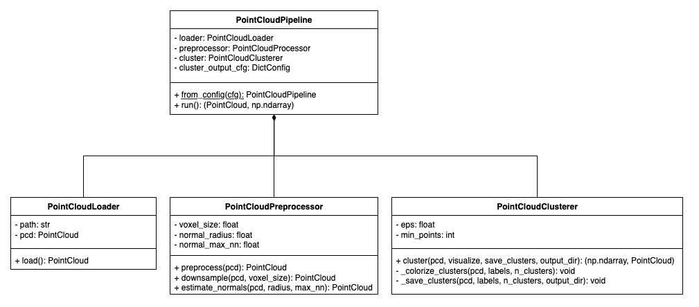
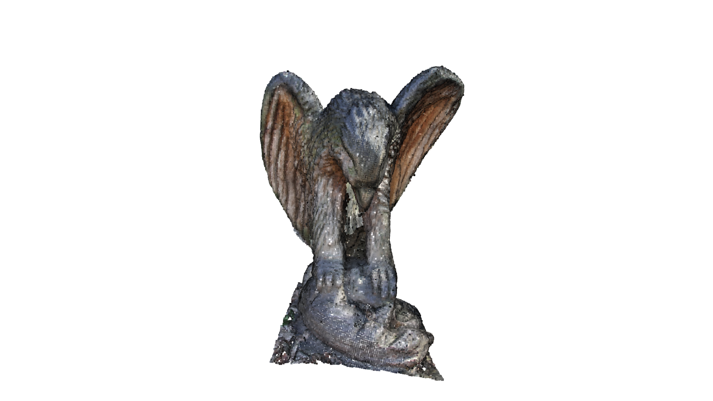
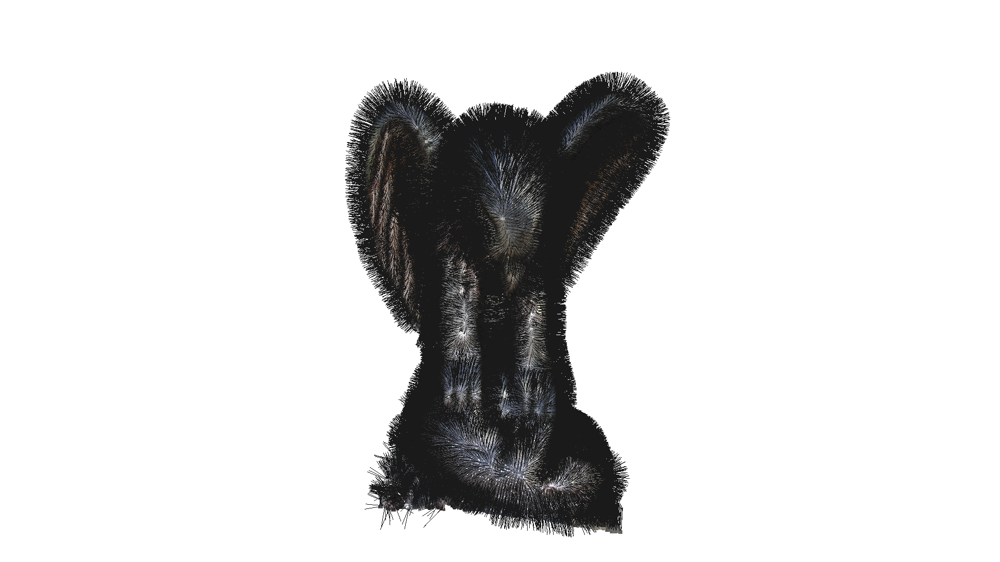
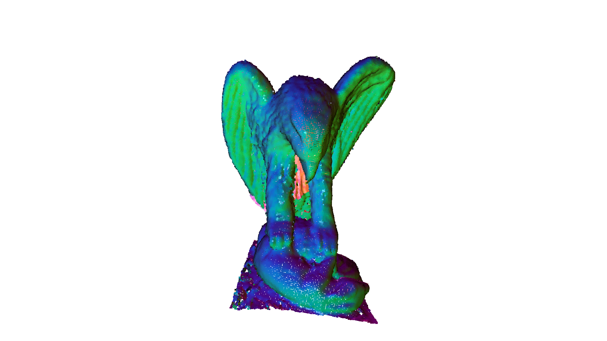
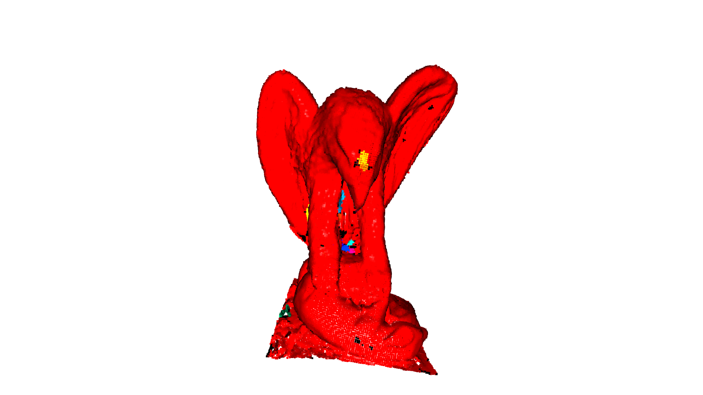

# Point Cloud Processing using Open3D

This project performs 3D point cloud processing using Open3D. The current functionalities include common preprocessing steps done on point cloud data, including **downsampling**, **surface normals estimation**, and **clustering**.

## Project Structure

### Folder Structure

- `conf/`: Configuration files to manage paramters for the pipeline
- `src/open3d_pc/`: Source code modules implementing loader, preprocessor, and clusterer classes
- `tests/`: Unit tests for core modules
- `main.py`: Entry point to run the pipeline
- `conda.yml`, `pyproject.toml`, `pixi.lock`: Environment and dependency management files

```shell
.
├── conf
│   ├── config.yaml
│   └── logging.yaml
├── src
│   └── open3d_pc
│       ├── __init__.py
│       ├── point_cloud_clusterer.py
│       ├── point_cloud_loader.py
│       └── point_cloud_preprocessor.py
├── tests
│   ├── test_point_cloud_clusterer.py
│   └── test_point_cloud_preprocessor.py
├── conda.yaml
├── main.py
├── pixi.lock
├── pyproject.toml
└── README.md
```

<!-- ├── docs - not sure if need show all??
│   ├── .png
│   ├── .png
│   ├── .png
│   └── .png -->

### Code Architecture

This project adopts OOP principles, using separate classes to implement each core point cloud processing step. Additionally, a `PointCloudPipeline` class orchestrates these components, managing the overall workflow from loading to clustering.

| Functionality | Corresponding Class | Description |
| ------------- | ------------------- | ----------- |
| Orchestrating pipeline        | `PointCloudPipeline`      | Coordinates loading, preprocessing, and clustering    |
| Loading point clouds          | `PointCloudLoader`        | Loads point cloud files or a default sample           |
| Downsampling                  | `PointCloudPreprocessor`  | Downsamples point cloud to reduce point density       |
| Surface normals estimation    | `PointCloudPreprocessor`  | Estimates surface normals to capture surface geometry |
| Clustering                    | `PointCloudClusterer`     | Separates point cloud into clusters                   |

The diagram below shows the UML class diagram of the point cloud processing pipeline design.


**Fig 1.** UML class diagram of the point cloud processing pipeline.


## Getting Started

### Clone the repository

```shell
git clone https://github.com/sc-see/open3d-pc.git
cd open3d-pc
```

### Set up the environment

Option A: Using [Pixi](https://pixi.sh/latest/)

```shell
pixi install
pixi run python main.py
```

This will run the full pipeline using the configuration provided in [`conf/config.yaml`](conf/config.yaml).

> 💡 **Tip:** `PointCloudPipeline` can also be imported and used directly in your own scripts.
>
> ```python
> from src.open3d_pc.pipeline import PointCloudPipeline
> 
> pipeline = PointCloudPipeline(...)
> pcd, labels = pipeline.run()
> ```


Option B: Using Conda

```shell
conda env create -f conda.yml
conda activate point-cloud-env
python main.py
```

## Examples

This section showcases intermediate results generated by running the point cloud processing pipeline using the default configuration provided in this repository.

| Description | Render |
| ----------- | :----: |
| **Input Point Cloud**                    | <br>*Raw input point cloud*                                   |
| **Downsampled Point Cloud**              | <br>*After voxel downsampling*                    |
| **Normals (Arrows)**                     | <br>*Normals as black arrows*               |
| **Normals (Colored by Direction)**       | <br>*Points colored by normal direction*  |
| **Clustered (Colored)**                  | <br>*Clusters shown with distinct colors*     |

All images were rendered using consistent camera parameters to ensure a stable viewpoint across stages.
